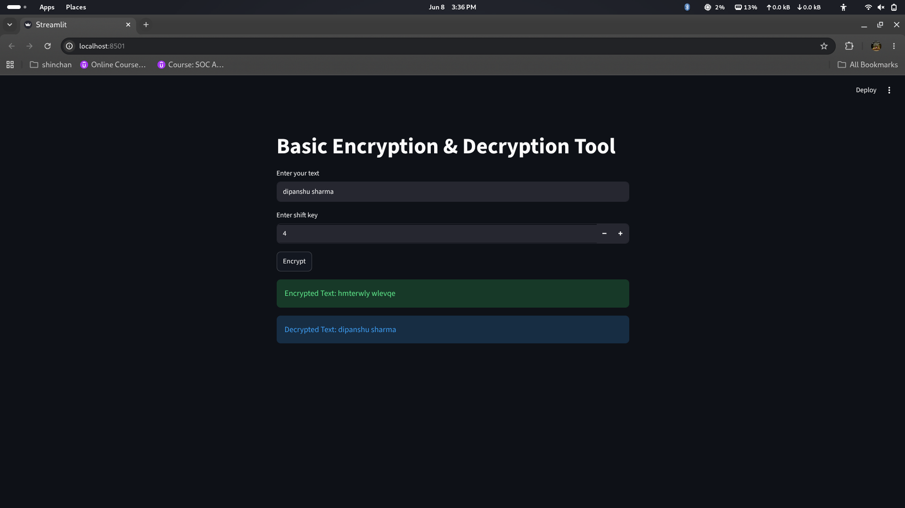

# Project-2: Caesar Cipher Encryption & Decryption Tool

## Overview
This project is a simple Encryption and Decryption Tool developed using Python and Streamlit. It implements the Caesar Cipher algorithm to encrypt and decrypt text using a user-defined shift key.

## Features
- Encrypt plain text
- Decrypt encrypted text
- User-friendly Streamlit interface
- Adjustable shift key

## Technologies Used
- Python
- Streamlit

## How to Run

1. Install dependencies:
   pip install -r requirements.txt

2. Run the application:
   streamlit run app.py

## Author
Dipanshu Sharma
B.Tech CSE | Cybersecurity Enthusiast

## Project Screenshot

